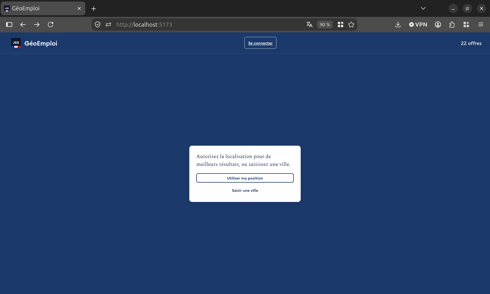
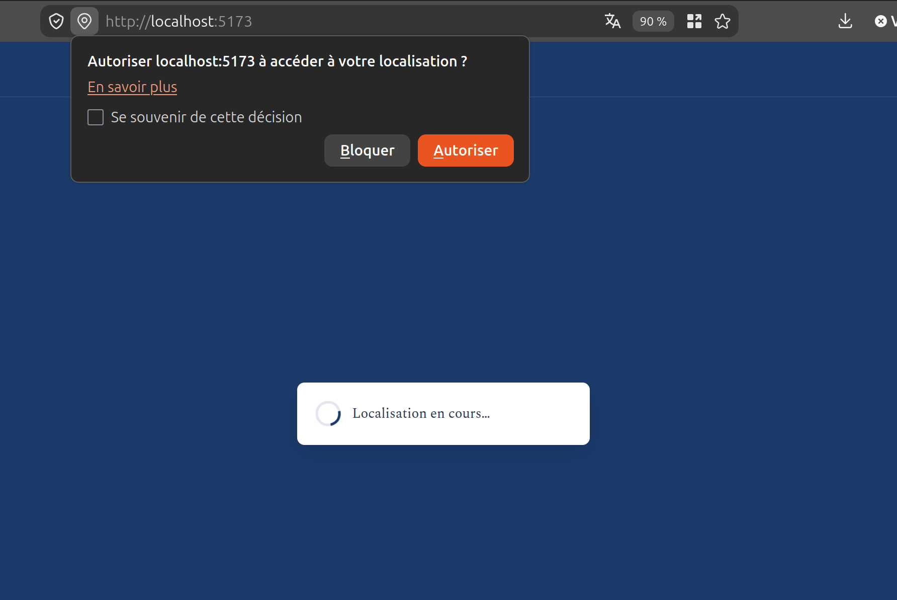
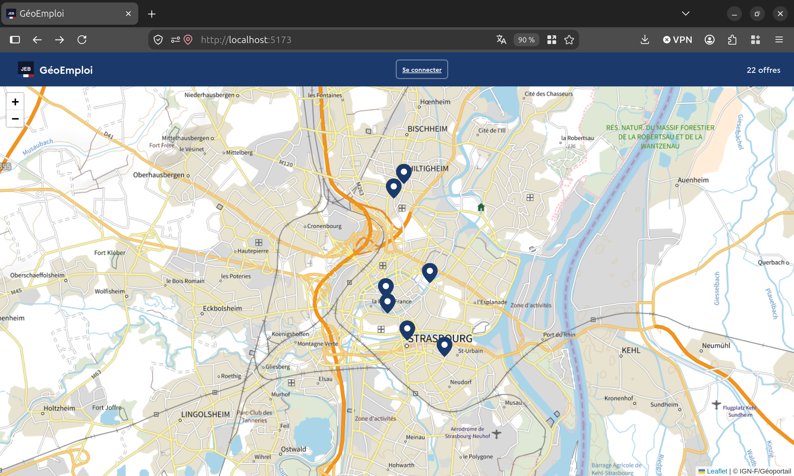
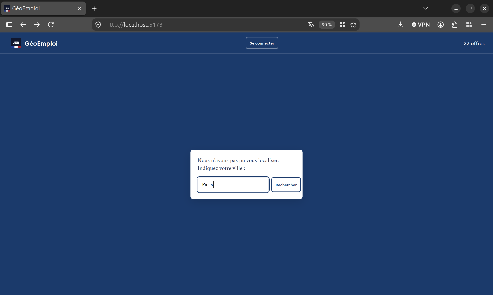
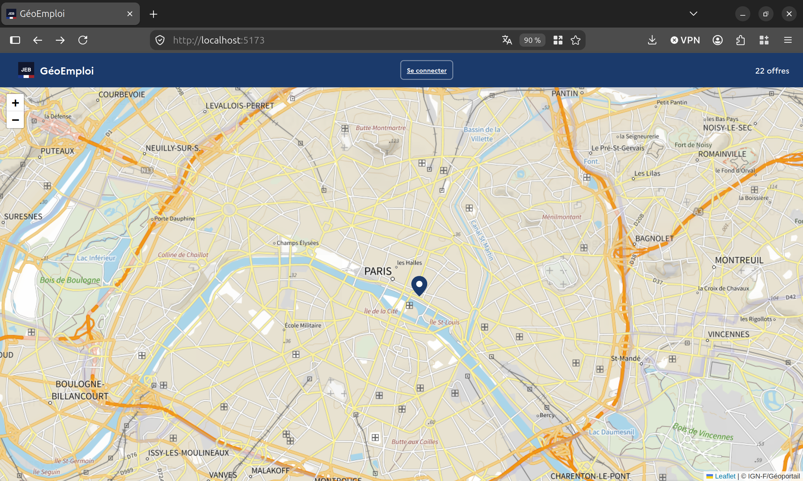
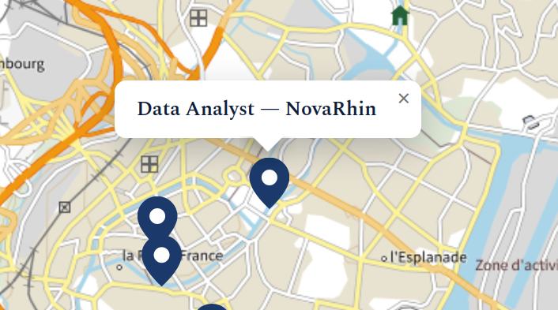
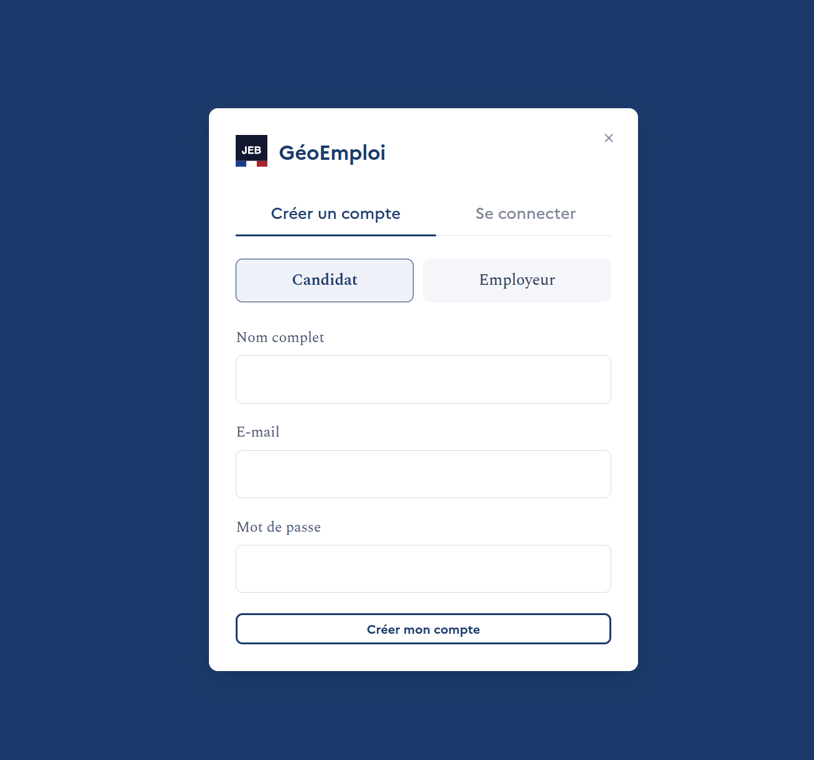
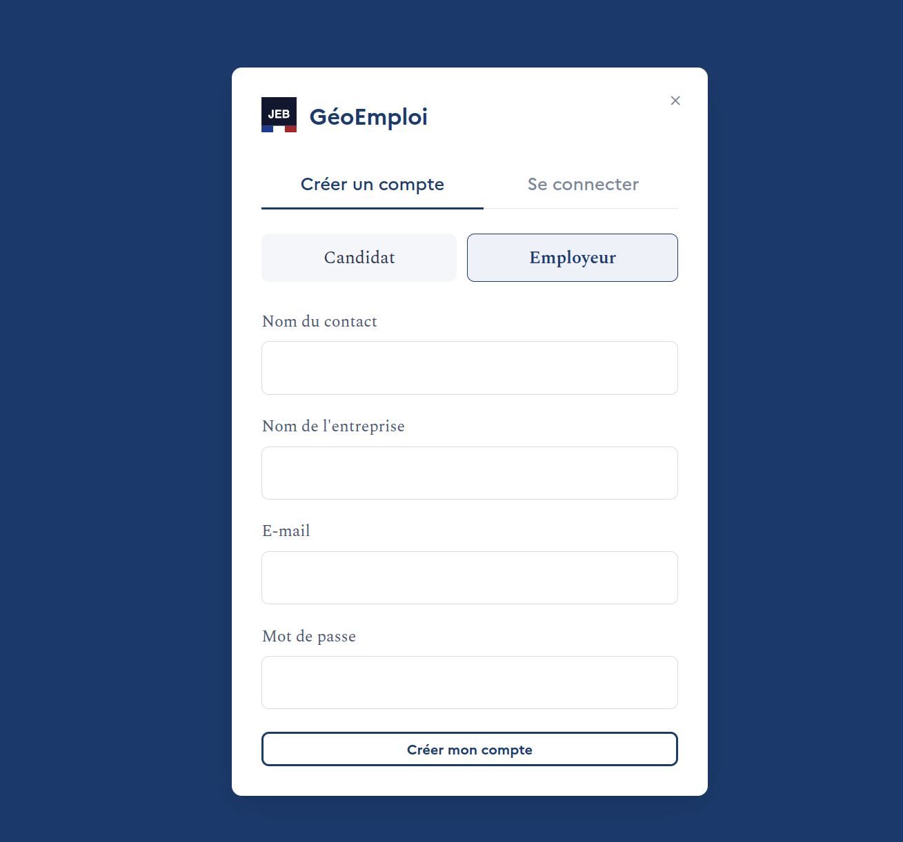
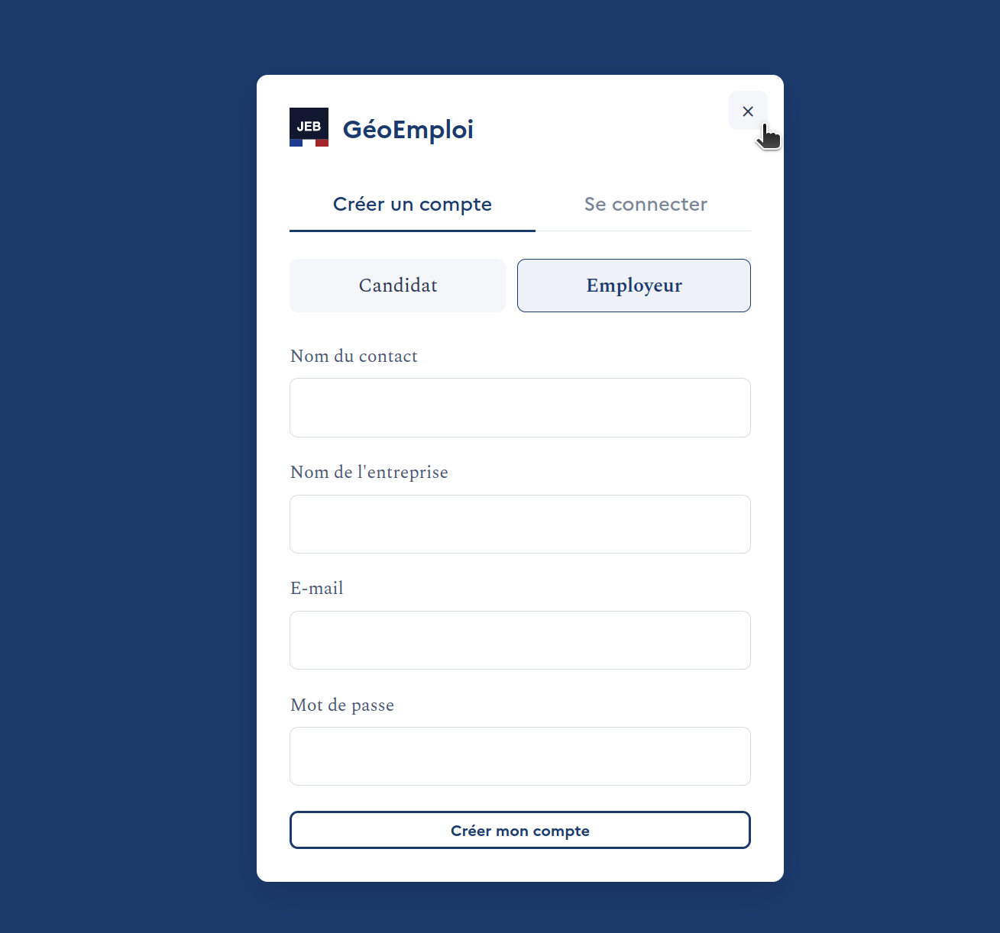

# GéoEmploi — Guide d'utilisation pas à pas

## Étape 1 — Page d'accueil
**Action :** Ouvrir l'application.
**Ce qu'on voit :** Un popup apparait et vous demande soit de partager votre géolocalisation soit de renseigner une ville.

## Étape 2 — Autoriser la localisation
**Action :** Cliquer sur « Utiliser ma position ».
**Ce qu'on voit :** Le navigateur demande l'autorisation, puis la carte se centre sur la position de l'utilisateur.

## Étape 3 — Alternative sans localisation
**Action :** Cliquer sur « Saisir une ville » et taper un nom de ville.
**Ce qu'on voit :** La carte se centre sur la ville saisie, sans avoir eu besoin d'autoriser la géolocalisation.

## Étape 4 — Consulter une offre
**Action :** Cliquer sur un point de la carte.
**Ce qu'on voit :** Une bulle s'affiche avec l'intitulé du poste.

## Étape 5 — Créer un compte
**Action :** Cliquer sur « Se connecter » en haut à droite, puis sur « Créer un compte ».
**Ce qu'on voit :** Le formulaire d'inscription, avec le choix entre profil candidat et profil employeur.

## Étape 6 — Retour à l'accueil
**Action :** Cliquer sur la croix en haut à droite du formulaire.
**Ce qu'on voit :** Retour à la carte.

---
